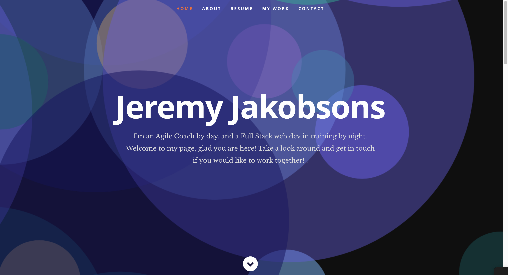

# Portfolio

  ## Table-Of-Contents 

  * [Description](#description)
  * [Installation](#installation)
  * [Usage](#usage)
  * [License](#license)
  * [Contributing](#contributing)
  * [Screenshot](#screenshot)
  * [Questions](#questions)

  ## Description

  My public project portfolio! 

  ## Installation

  To install this code, first clone the repo. Then install run an "npm i" from the projects root folder to install the appropriate packages. 

  ## Usage

  Once installed, you should be able to start the server using the "npm start" command. This should auto open in your browser, or navigate to localhost in your browser of choice.

  ## License

  This project is covered under the following license: 
  MIT

  ## Contributing 
  NPM Packages used: 
  Node, Express, jquery, React 
  Link to resume template https://github.com/nordicgiant2/react-nice-resume 

  ## Screenshot

Link to Live Application: https://jjakobsons87.github.io/portfolio/ 

  ## Questions 

  Any questions? Reach out to me via GitHub or Email!  
  [Github](https://github.com/jjakobsons87)  
  [Email](mailto:jjakobsons87@gmail.com)